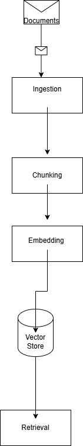

# Project 1 Planning: The Unofficial Guide

> Write this document before you write any pipeline code.
> Your spec and architecture diagram are what you'll use to direct AI tools (Claude, Copilot, etc.) to generate your implementation — the more specific they are, the more useful the generated code will be.
> Update the Retrieval Approach and Chunking Strategy sections if you change your approach during implementation.
> Update this file before starting any stretch features.

---

## Domain
Steps to optimize you computer. This domain topic is valuable because students have issues with their pc almost every day. It is hard to find concrete solutions to solve generic problems. They go to reddit or wikihow, or they use generic AI prompt to fix the issue.
<!-- What domain did you choose? Why is this knowledge valuable and hard to find through official channels? -->

---

## Documents

<!-- List your specific sources: URLs, subreddit names, forum threads, or file descriptions.
     Aim for at least 10 sources that together cover different subtopics or perspectives within your domain. -->

| # | Source | Description | URL or location |
|---|--------|-------------|-----------------|
| 1 |microsoft|Tips to improve PC perfomance in Windows |[Link](https://support.microsoft.com/en-us/windows/tips-to-improve-pc-performance-in-windows-b3b3ef5b-5953-fb6a-2528-4bbed82fba96) |
| 2 |chrome |Making chrome faster |[Link](https://support.google.com/chrome/answer/1385029?utm_source=chatgpt.com) |
| 3 |harvard|Naming convections for files |[Link](https://datamanagement.hms.harvard.edu/plan-design/file-naming-conventions?utm_source=chatgpt.com) |
| 4 |vanderbilt |common audio and video issues during Microsoft teamd and zoom |[Link](https://tdx.vanderbilt.edu/TDClient/33/Portal/KB/PrintArticle?ID=275&utm_source=chatgpt.com) |
| 5 |microsoft|folder organization|[Link](https://www.microsoft.com/en-us/windows/learning-center/create-new-folders-to-organize-files?utm_source=chatgpt.com) |
| 6 |microsoft |free up drive space in windows[link](https://support.microsoft.com/en-us/windows/free-up-drive-space-in-windows-85529ccb-c365-490d-b548-831022bc9b32?utm_source=chatgpt.com) |
| 7 |microsoft |file explorer in windows |[link](https://support.microsoft.com/en-us/windows/file-explorer-in-windows-ef370130-1cca-9dc5-e0df-2f7416fe1cb1?utm_source=chatgpt.com) |
| 8 |techcommunity.microsoft.com |overview of resource monitor |[link](https://techcommunity.microsoft.com/blog/askperf/using-resource-monitor-to-troubleshoot-windows-performance-issues-part-1/375008?utm_source=chatgpt.com) |
| 9 |learn.microsoft|troubleshoot proecesses by using task manager |[link](https://learn.microsoft.com/en-us/troubleshoot/windows-server/support-tools/support-tools-task-manager?utm_source=chatgpt.com) |
| 10 |suppport.microsoft |;earn about perofmance features in microsoft edge |[link](https://support.microsoft.com/en-US/edge/learn-about-performance-features-in-microsoft-edge) |

---

## Chunking Strategy

<!-- How will you split documents into chunks?
     State your chunk size (in tokens or characters), overlap size, and explain why those
     numbers fit the structure of your documents.
     A review-heavy corpus warrants different chunking than a long FAQ. -->

**Chunk size:**
1000 cahracters( 250 tokens) - it is right uner the capped ceiling and should keep the procdure whole. WIll adjust if needed.
**Overlap:**
start 100 -200 characters. if the overlap is too large and the information is reduntant iI will reduce. If it gets to fragmented then increae, however this should be more than enough

**Reasoning:**

 I will using smaller chunking with headers in order to retrieve precise documentation over. I do not want my chunks to have incorrect or segmented imformations

---

## Retrieval Approach

<!-- Which embedding model are you using (e.g., all-MiniLM-L6-v2 via sentence-transformers)?
     How many chunks will you retrieve per query (top-k)?
     If you were deploying this for real users and cost wasn't a constraint, what tradeoffs
     would you weigh in choosing a different embedding model — context length, multilingual
     support, accuracy on domain-specific text, latency? -->

**Embedding model:**
all-MiniLM-L6-v2 (sentence-transformers) — ~256-token ceiling

**Top-k: 3**
K - 3 so it has a diecision to from the top 3 results. if its too high there is too much background noise. If its too low, it assumes that the one chunk is always correct which is not true.
**Production tradeoff reflection:**
So because there is a 256 token ceiling, tokens are capped at 1000. It isn't a problem for a user, but the chunks being retrieve may extend up to 1000 characters

CONTEXT LENGTH is important

Multilugual- It can only be in english

Accuracy on domain-sepecific text- a general purpose model should be able to handle the technical terms well. 

Latency - Smaller model means faster time. However the smaller model has limited token ceiling of 256
---

## Evaluation Plan

<!-- List your 5 test questions with their expected correct answers.
     Questions should be specific enough that you can judge whether the system's response
     is right or wrong. "What are good dining halls?" is too vague.
     "What do students say about wait times at [dining hall name] during lunch?" is testable. -->

| # | Question | Expected answer |
|---|----------|-----------------|
| 1 |"My pc is running slow" |Try opening task manager and closing some tasks |
| 2 |"Nobody can hear me on zoom call."|"Make sure the input is correct". |
| 3 |"Chrome is taking a long time to load" |Try closing some tabs |
| 4 |"what should i name my folder" |"With a naming convention :20160104_ProjectA_Ex1Test1_SmithE_v1.xlsx"|
| 5 |"How do I find X file |"Open file exploren and navigiate  |

---

## Anticipated Challenges

<!-- What could go wrong? Name at least two specific risks with reasoning.
     Consider: noisy or inconsistent documents, missing source attribution, off-topic
     retrieval, chunks that split key information across boundaries. -->

1.Chunks that split key information. Because there are alot of vague questions that can related to a number of issues, if my retrivle chunking isn't concise it can oull imforation that is useful but doesnt actually solve the proble.

2. It may possibly give pieces of imforation with bad context. the documetns are really noisy, so the overlap me not be accruate enough so it doesn't pull ifrmation that start or ends in the middle of no where

---

## Architecture

<!-- Draw a diagram of your pipeline showing the five stages:
     Document Ingestion → Chunking → Embedding + Vector Store → Retrieval → Generation
     Label each stage with the tool or library you're using.
     You can use ASCII art, a Mermaid diagram, or embed a sketch as an image.
     You'll use this diagram as context when prompting AI tools to implement each stage. -->

---

## AI Tool Plan

<!-- For each part of the pipeline below, describe:
     - Which AI tool you plan to use (Claude, Copilot, ChatGPT, etc.)
     - What you'll give it as input (which sections of this planning.md, which requirements)
     - What you expect it to produce
     - How you'll verify the output matches your spec

     "I'll use AI to help me code" is not a plan.
     "I'll give Claude my Chunking Strategy section and ask it to implement chunk_text()
     with my specified chunk size and overlap" is a plan. -->

**Milestone 3 — Ingestion and chunking:**
AI Tool:
Using Claude tool to assist in some of the coding. It will fight back on me when I ask to generate code and actually teach me on how to develop it.

It will take charge in developing the chunking() function
Input: 
It will take in chunking strategy of the this document.

Expected output:
It should effectibly produce the chunking function. It should be in its own seperate file so it can be imported into other files.
Verify:
1. Print the length of every chunk — they should cluster around 1000 characters,
   and none should blow far past it (a 4000-char chunk = the size spec was ignored).
2. The end of chunk 1 should reappear at the start of chunk 2 (overlap worked).
3. The first line of each chunk should be a header, not a random mid-procedure fragment. Headers help with accurasy. !000 character limit makes sure the token size is capped.

**Milestone 4 — Embedding and retrieval:**
AI Tool:
Claude will generate the code for embedding while assiting in the code necesarry for retrieval

It will asssit in retriaval() function guiding me to a solution by provided comments to guide me to a solution. Do not give me completed code. If can have snips of code in comments as hint.
Input:
The Retrieval Approach section of this document (embedding model = all-MiniLM-L6-v2,
top-k = 3).

Expected output:
Code that embeds each chunk into a vector with sentence-transformers and stores it
in ChromaDB, plus a retrieval() function that takes a user question and returns the
top-3 most similar chunks. In its own file so it can be imported.

Verify:
For retrieval I need to test if the right chunk came back — run a test question
(e.g. "nobody can hear me on Zoom") and confirm the mic-input procedure is in the
top-3 results.

**Milestone 5 — Generation and interface:**
AI Tool:
Claude will generate the code for the interface while being a coach and assisting with the code for generation().It will prove comments to guide me to a solution. Do not give me completed code. If can have snips of code in comments as hint.

It will take charge in deveoping the interface() function
Input:
The retrieved top-3 chunks plus the user's question, sent to the Groq LLM. Interface
built with gradio (or streamlit) per the query-interface line in requirements.txt.

Expected output:
A working query interface where a user types a question and gets back an answer
generated from the retrieved chunks.

Verify:
I must judge the final answer — run all 5 of my Evaluation Plan questions end-to-end
and check the LLM turned the retrieved chunks into the expected response.